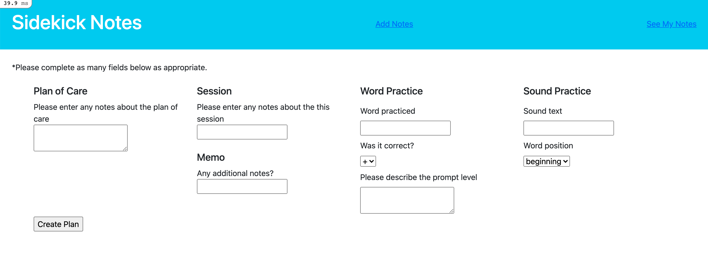

# Sidekick-Notes

Sidekick Notes is a scoped app that will allow users to enter notes regarding children's speech therapy sessions. 

Thank you for taking the time to review my submission. I welcome your feedback and look forward to talking with you! 

## Table of Contents
* [Notes](#notes)
* [Next_Steps](#nextsteps)
* [Screenshot](#screenshot)

## Notes
* The app is capped at 10 hours of work.

## Next_Steps
**& Things I'd Implement with More Time**
* RSpec test coverage
* Error handling
* Change Sessions model name. It could conflict in the future with User authentication sessions.
* On that note, implement Users and their various roles, along with authentication.
* I included more associations in the migrations than I used. I'd like to implement many-to-many associations where appropriate. 
* Regarding associations, it would be helpful to be able to add multiple items inside a nested form. (For example: One session may have more than one word practiced. As a user, I would want to be able to add both */sh/* and */th/* for one session.)
* Implement update and delete actions for models.
* This plan form is deeply nested. Perhaps there is an alternative, easier way to accomplish what the plan form does without the wild nesting. Dig further into this.
* More styling + make app responsive (at least to laptop sizes. My guess is that this app would likely not be used from XS-Med size devices?)

### Specifically regarding the Note model
**If users don't want to use the form (or if it is not flexible enough):**
**Users should be able to enter notes here, and the app will be able to parse for them. This is how I would start:**

* I envisioned using RegEx to parse notes that a user may enter. [Rubular](https://rubular.com/) is my best friend here.
* I also thought about using a Gem that will allow for fuzzy matches to encapsulate any short-hand that I would consistently see added to notes. [Fuzzy Match](https://github.com/seamusabshere/fuzzy_match) seems to be what I'm looking for.
* Lastly, (and this is perhaps a bit of a... *creative* solution) I thought about potentially including I18n not for localization, but as a way to translate shorthand to longhand while parsing to save to the database.

## Screenshot
 

